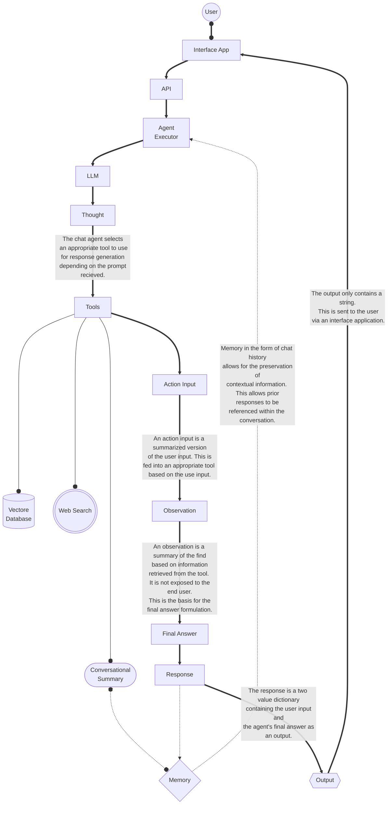

```mermaid
flowchart TD;

    id9((User)) o==o id0[Interface App];

    id0 ==> API ==> id1[Agent\n Executor] ==> LLM ==>
    Thought ==>|The chat agent selects\n an appropriate tool to use\n for response generation \n depending on the prompt recieved.| Tools;

    Tools ==> id5[Action Input]  
    
    Tools <==o id2([Conversational\n Summary]) & id3[(Vectore\n Database)] & id4(((Web Search)));

    id5 ==> |An action input is a summarized version\n of the user input. This is fed into an appropriate tool based on the use input.| Observation;

    Observation ==>|An observation is a summary of the find\n based on information retrieved from the tool. \n It is not exposed to the end user.\n This is the basis for the final answer formulation. | id6[Final Answer];

    id6 ==> Response;
    id2 o-.-o id7{Memory}

    Response o-.-> id7
    Response ==>|The response is a two value dictionary\n containing the user input and\n the agent's final answer as an output.| id8{{Output}};

    

    id7 -.-> | Memory in the form of chat history\n allows for the preservation of\n contextual information.  This allows prior\n responses to be referenced within the conversation.| id1;

    id8 ==>|The output only contains a string.\n This is sent to the user\n via an interface application.| id0; 
   
```
